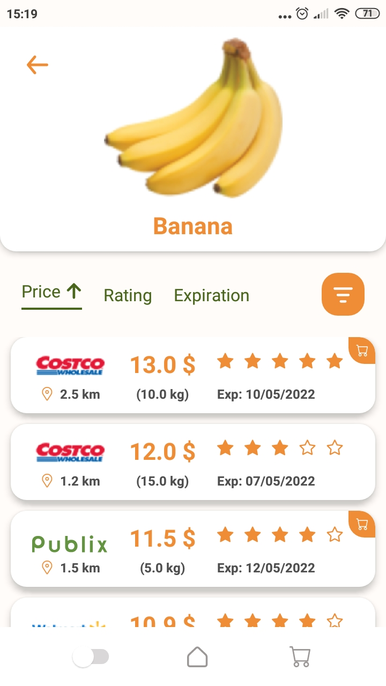
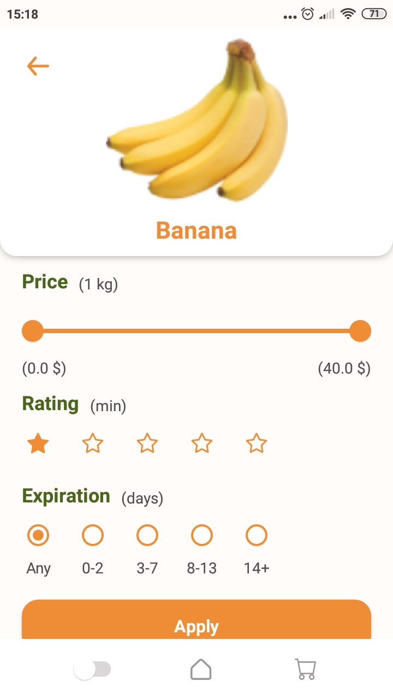

# Pricey

E-commerce app written with Jetpack Compose

## See our tutorial posts:

[How to Make an Android E-commerce Price Comparison App From Scratch](https://perpet.io/blog/how-to-make-an-android-e-commerce-price-comparison-app-from-scratch/)

## Preview
<p align="center">
    
    
    
    
</p>

## Features include:
* display products by category
* search of products
* filter and sort products by price, rating and expiration date
* make a basket list
* dark theme support

## Dark theme


## Used libraries:
* [Navigation Component](https://developer.android.com/jetpack/compose/navigation) - provides navigation between composables while taking advantage of the Navigation component’s infrastructure and features.
* [System UI Controller](https://google.github.io/accompanist/systemuicontroller/) - provides easy-to-use utilities for updating the System UI bar colors within Jetpack Compose.

## Getting started
1. Clone the repo
```
 $ git clone https://github.com/perpetio/pricey.git
 ```
2. Open project in Android studio or IntelliJ IDEA
3. Run on android device using your IDE's tools.
